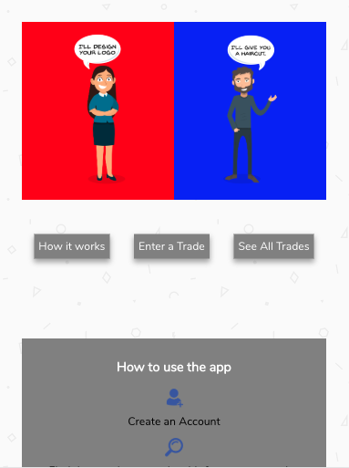
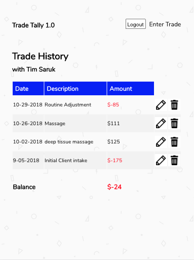

# Trade Tally
A responsive web app that lets you record your service trades, so you know what your balance is (positive or negative) with any of your trade partners. See live demo [here](https://trade-tally-client.herokuapp.com/)

The backend server side code was build with Node.js and Mongo DB. The repo can be found [here](https://github.com/oneEyedBunny/Trade-Tally-Server)

## Motivation
Currently I'm a hairstylist. I trade services with a variety of people: Chiropractors, Massage Therapists, Aetheticians, etc. Problem is, we're all left manually recording trades if we want to know who's owed who a service since our client management systems aren't linked together. I wanted an easy way to record when either party has performed a service, what the value of that service is, and what my balance is so I can determine who's turn it is. Trade Tally lets you do this. With a few clicks it provides an easy way to enter trades, see a summary of where all your trades are at, and dig into the details of your trade history.

## Technology Used
- React/Redux
- Enzyme/Jest
- Node/Express
- Mongo
- twilio
- Continuous Integration & deployment with Travis CI
- HTML
- CSS

# Code clean up
1. console.logs or misc commented out code removed

# Future 2.0 features:
1. Add location feature, so logic will search names by location of person
1. Add ability for trades to be confirmed by the receiving partner
1. Make the fields in the history table editable, add a dot drop down on left that lets you delete/edit
1. Add autocomplete to new trade form drop down (https://alligator.io/react/react-autocomplete/_)
1. Improve window confirm for delete button formatting
1. Create password reset feature
1. Date on new trade isn't populating on edit
1. Test cases for reducers & actions
1. Create acct success message gets cleared before displayed to user
